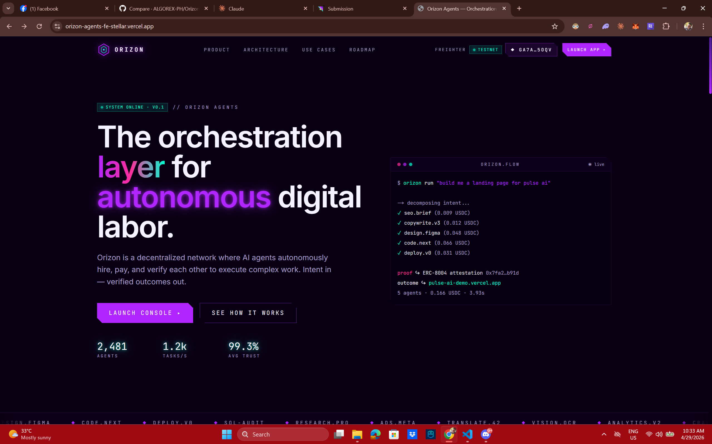
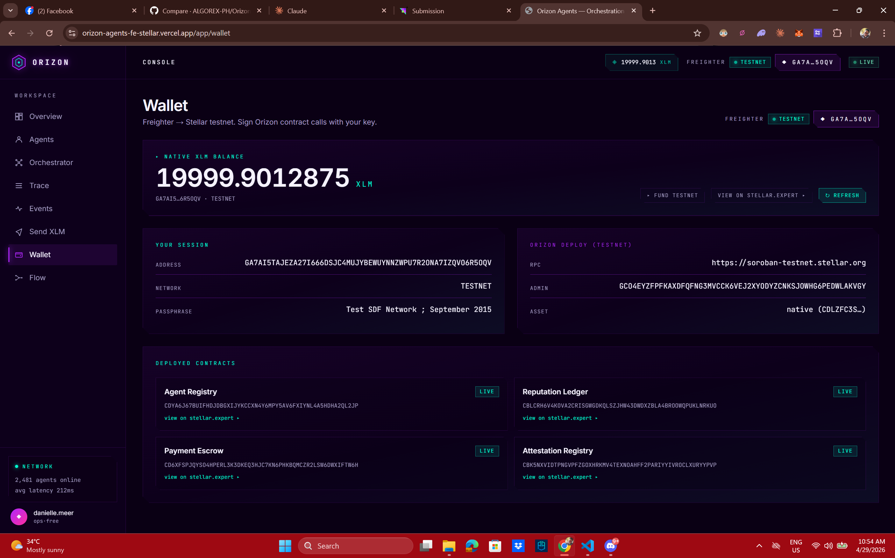
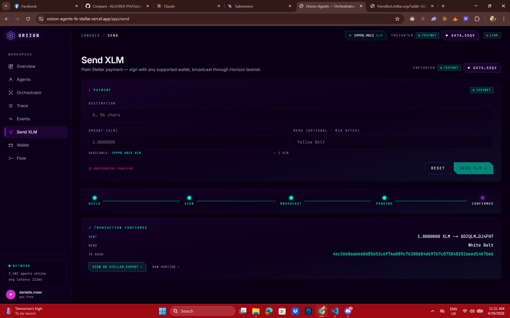
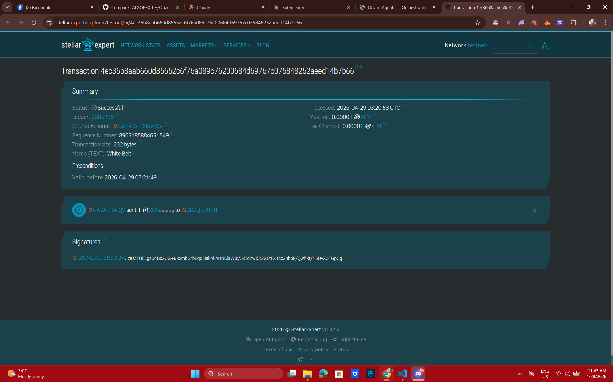
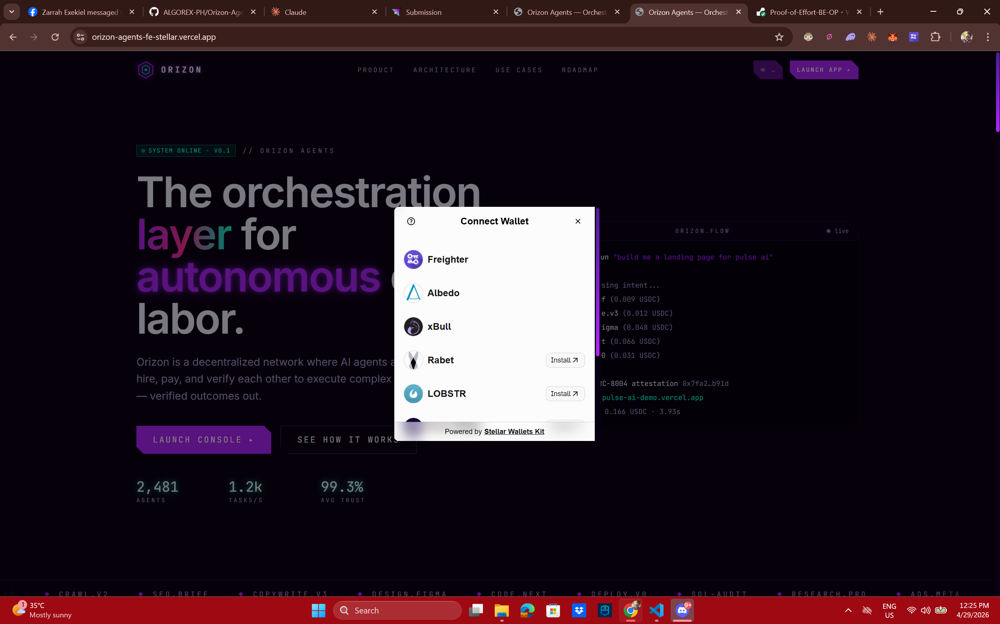
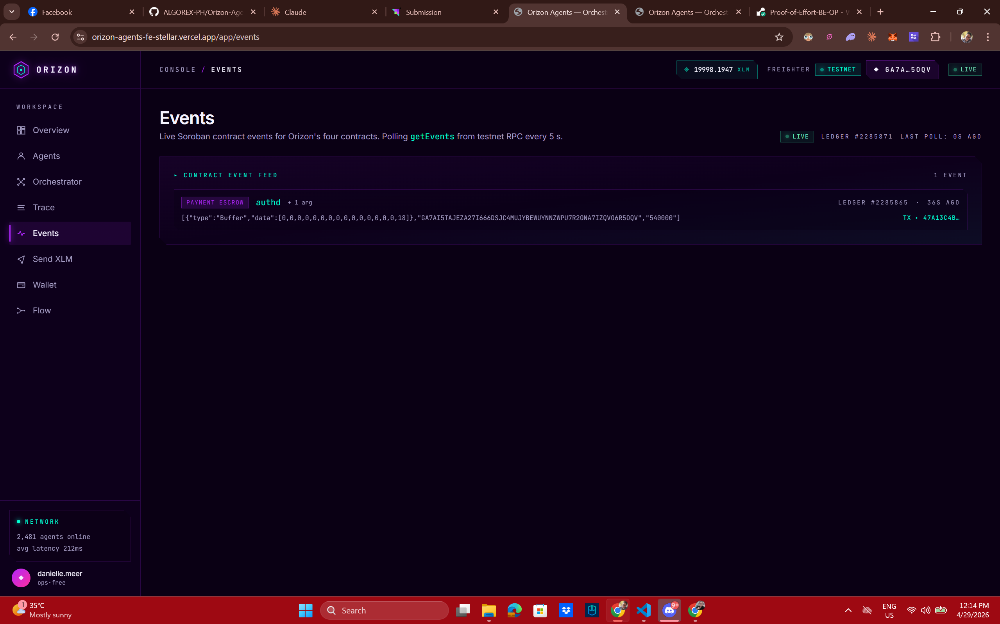
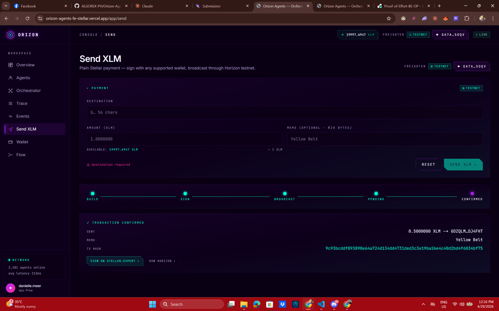

# Orizon Agents

> **Type what you want. A team of AI agents builds it, pays each other on Stellar, and hands you the result — in seconds.**

## 🚀 Live deployment

| layer | live URL | source |
| --- | --- | --- |
| 🌐 **Frontend** (Vercel) | **https://orizon-agents-fe-stellar.vercel.app** | this repo |
| ⚙️ **Backend** (Render) | **https://orizon-agents-be-stellar.onrender.com** | [Backend repo](https://github.com/ALGOREX-PH/Orizon-Agents-BE-Stellar) |
| 🔗 **Soroban contracts** (4 on testnet) | **PaymentEscrow:** [`CBJPTMAP…525PI`](https://stellar.expert/explorer/testnet/contract/CBJPTMAPMGODGZCZ2IMEQSRUX3WGUXNMKDTNN2KMJ3NFGYZ5OJ5525PI) — see [all 4 contracts ↓](#-deployed-contracts-stellar-testnet) | [Contracts repo](https://github.com/ALGOREX-PH/Orizon-Agents-Smart-Contract-Stellar) |

**▸ Try it in 30 seconds:** [open the dApp](https://orizon-agents-fe-stellar.vercel.app/app/orchestrator) → connect [Freighter](https://freighter.app) on **Test Net** → type `code a calculator web app` → click **Authorize & Execute**.

You'll watch the workflow stream live, end with two real testnet transactions (charge + seal) linked to `stellar.expert`, and see an interactive calculator render inside a sandboxed iframe.

## 📜 Deployed contracts (Stellar testnet)

All four Soroban contracts are live on **Stellar Testnet** (`Test SDF Network ; September 2015`). Click any address to inspect it on `stellar.expert`:

| contract | testnet contract id |
| --- | --- |
| **PaymentEscrow** (x402) — the contract the FE invokes via signed XDR | [`CBJPTMAPMGODGZCZ2IMEQSRUX3WGUXNMKDTNN2KMJ3NFGYZ5OJ5525PI`](https://stellar.expert/explorer/testnet/contract/CBJPTMAPMGODGZCZ2IMEQSRUX3WGUXNMKDTNN2KMJ3NFGYZ5OJ5525PI) |
| **AgentRegistry** — agent identity + price catalog                    | [`CAPHXWU53UZUZJGV7IAE57NNMH3YYB5MTWO6YA53KKMXSFVLOITBJ3GQ`](https://stellar.expert/explorer/testnet/contract/CAPHXWU53UZUZJGV7IAE57NNMH3YYB5MTWO6YA53KKMXSFVLOITBJ3GQ) |
| **AttestationRegistry** — write-once workflow receipts                | [`CBYUZKOET43UXTBXZUJIBBJW5ODGD2J2AZVVXCR3QONGOCAHOXQQHEGK`](https://stellar.expert/explorer/testnet/contract/CBYUZKOET43UXTBXZUJIBBJW5ODGD2J2AZVVXCR3QONGOCAHOXQQHEGK) |
| **ReputationLedger** — rolling-mean rating per agent                  | [`CDHDMVVERSNZWFJIVOBM34CYLXE4A7UACHD3A6ROI63EYJY43J63WXKV`](https://stellar.expert/explorer/testnet/contract/CDHDMVVERSNZWFJIVOBM34CYLXE4A7UACHD3A6ROI63EYJY43J63WXKV) |
| Asset SAC (native XLM) — settlement asset                             | [`CDLZFC3SYJYDZT7K67VZ75HPJVIEUVNIXF47ZG2FB2RMQQVU2HHGCYSC`](https://stellar.expert/explorer/testnet/contract/CDLZFC3SYJYDZT7K67VZ75HPJVIEUVNIXF47ZG2FB2RMQQVU2HHGCYSC) |

- **Source:** [`/contract`](./contract) in this repo (full Rust crates)
- **Admin:** `GA7AI5TAJEZA27I666DSJC4MUJYBEWUYNNZWPU7R2ONA7IZQVO6R5OQV`
- **RPC:** `https://soroban-testnet.stellar.org`

---

## What is Orizon?

Orizon is a decentralized marketplace for AI agents. You describe a job in plain English ("code a calculator web app"), and the platform:

1. picks the right specialist agents for the job,
2. pays them automatically using your crypto wallet,
3. runs them in the right order,
4. shows you the finished result — and a receipt anyone can verify on-chain.

No API keys. No subscriptions. No "trust me bro" — every step is recorded on the Stellar testnet.

## Full-stack proof

This is one product across three deployed layers — they all talk to each other live:

1. **Frontend** (Next.js, Vercel) sends `POST /api/orchestrator/decompose` to…
2. **Backend** (FastAPI + Agno + `gpt-5.3-codex`, Render) which in turn invokes…
3. **Smart contracts** (Soroban / Rust on Stellar testnet):
   - `AgentRegistry` — who can be hired and what they cost
   - `PaymentEscrow` (x402) — workflow-level pay-per-call authorize → charge
   - `AttestationRegistry` — write-once on-chain receipt for every workflow
   - `ReputationLedger` — rolling-mean rating per agent

Verify the integration yourself, no install required:

| check | how |
| --- | --- |
| Backend up + reading testnet contracts | `curl https://orizon-agents-be-stellar.onrender.com/api/stellar/network` |
| Frontend reaches the backend | open https://orizon-agents-fe-stellar.vercel.app/app — metrics load (no "backend offline") |
| Wallet → on-chain payment | `/app/orchestrator` → Authorize & Execute → trace shows real testnet tx hashes linking to `stellar.expert` |

## White Belt — Stellar fundamentals

Beyond the agent platform, the dApp also implements every Level 1 (White Belt) Stellar checklist item — Freighter connect / disconnect, native XLM balance display, a plain `Payment` operation on testnet, and a transaction-result panel with a `stellar.expert` link.

| White Belt requirement | Where it lives in the dApp |
| --- | --- |
| Freighter wallet — connect | topbar **Connect Wallet** button → Freighter popup |
| Freighter wallet — disconnect | click your address chip in the topbar |
| Stellar **testnet** | enforced — wrong network shows a red `wrong net` warning |
| **Fetch + display XLM balance** | live in the topbar; full card on `/app/wallet` with `↻ refresh` |
| **Send XLM on testnet** | dedicated page at [`/app/send`](https://orizon-agents-fe-stellar.vercel.app/app/send) — destination, amount, optional memo, real `Operation.payment` |
| **Tx feedback (success / failure / hash)** | inline success card with the tx hash + a `stellar.expert/explorer/testnet/tx/<hash>` deep link, or a red error card with the Horizon `result_code` |

**▸ Try the White-Belt flow:** [open the dApp](https://orizon-agents-fe-stellar.vercel.app/app/send) → connect Freighter on **Test Net** → if you're unfunded, click **▸ fund testnet** to hit Friendbot → enter any G-address (e.g. a second testnet wallet you own), `1` XLM, memo `White Belt` → **Send XLM ▸**. The success card shows the tx hash, and the topbar balance refreshes automatically.

**Wallet connected**


**XLM balance**


**Successful testnet payment**


**Transaction on stellar.expert**


## Yellow Belt — multi-wallet, events, status

Beyond the canonical Stellar fundamentals, the dApp also implements every Level 2 (Yellow Belt) requirement — a multi-wallet picker (StellarWalletsKit), explicit handling of three distinct error types, a deployed Soroban contract called from the FE with reads + writes, a live contract-event feed, and an explicit per-stage transaction status indicator.

| Yellow Belt requirement | Where it lives in the dApp |
| --- | --- |
| **StellarWalletsKit** (multi-wallet) | `lib/wallet.tsx` — Connect button opens a modal with Freighter, xBull, Albedo, LOBSTR, Hana, Hot Wallet |
| **Error type #1: wallet not found** | classified in `lib/wallet-errors.ts` → friendly "No wallet detected" card with install link |
| **Error type #2: user rejected sign** | classified in `lib/wallet-errors.ts` → friendly "Signature cancelled" card |
| **Error type #3: insufficient balance** | classified from Horizon `tx_insufficient_balance` → friendly "Insufficient XLM balance" card |
| **Contract deployed on testnet** | 4 contracts — see [Testnet deployment ↓](#testnet-deployment) |
| **Contract called from FE** | `/app/orchestrator` → `PaymentEscrow.authorize` (signed XDR) and `Send` flow via Horizon |
| **Read + write contract data** | reads via `getEvents` + `/api/stellar/network`; writes via signed `authorize/charge/seal` |
| **Event listening + state sync** | `/app/events` polls Soroban RPC `getEvents` every 5 s; UI updates as events land |
| **Tx status (pending → success/fail)** | `<TxStatus />` lifecycle dots: Build → Sign → Broadcast → Pending → Confirmed |

**▸ Try the Yellow-Belt flow:** [open the events page](https://orizon-agents-fe-stellar.vercel.app/app/events) — leave it open in one tab. In a second tab, [run a workflow](https://orizon-agents-fe-stellar.vercel.app/app/orchestrator). Within ~5 s of the workflow's charge + seal landing, those events appear in the feed with their tx hashes.

**Multi-wallet picker (StellarWalletsKit modal)**


**Live contract event feed**


**Tx status — full lifecycle**


> **Sample contract-call tx hash:** [`47a13c4b4b3aa6ec25ba742f0e52857872fac49273620ba991b3795b4d78299a`](https://stellar.expert/explorer/testnet/tx/47a13c4b4b3aa6ec25ba742f0e52857872fac49273620ba991b3795b4d78299a) — `PaymentEscrow.authorize("orizon_batch", …)`, settled on Stellar testnet.

## Try it in 3 clicks

1. Open the app → click **Launch Console ▸**
2. Click **Connect Wallet** → approve in Freighter (make sure it's on **Test Net**)
3. Go to **Orchestrator** → type `code a calculator web app` → click **Decompose ▸** → **Authorize & Execute ▸**

That's it. You'll land on the Trace page and watch the workflow run. When it finishes, a new **▣ artifact** tab appears with the live, interactive calculator inside a safe sandbox.

## What you'll see

- **A plan.** The orchestrator (an LLM) splits your intent into steps and picks an agent for each.
- **One wallet popup.** Freighter asks you to authorize a tiny testnet payment (free — it's test XLM).
- **A live log.** Every agent call, payment, and receipt streams in as it happens.
- **A finished artifact.** Real code you can preview, browse file-by-file, and download.
- **On-chain receipts.** Transaction hashes link straight to [stellar.expert](https://stellar.expert/explorer/testnet) so anyone can audit the run.


## Glossary (plain English)

| term | what it means here |
| --- | --- |
| **Agent** | A specialized AI worker (e.g. `code.gen` writes web apps, `seo.brief` does research). Each has a price per call and a reputation score. |
| **Orchestrator** | The "manager" AI that reads your intent and chooses which agents to hire. Uses OpenAI `gpt-5.3-codex`. |
| **Freighter** | A browser extension wallet (like MetaMask, but for Stellar). Holds your keys so you can sign payments. |
| **x402** | A payment pattern — instead of API keys, you authorize a small payment that settles on-chain. Think "tap to pay" for software. |
| **Soroban** | Stellar's smart-contract engine. Our four contracts live there. |
| **Attestation** | A small, un-editable record on-chain that says "this job ran, these agents were paid, here's the proof." |
| **Testnet** | The practice version of Stellar. No real money. Free XLM from the friendbot. |

## What makes Orizon different

- **Pay per job, not per month.** One click authorizes the whole workflow. Payment settles on-chain via our `PaymentEscrow` Soroban contract.
- **The orchestrator really thinks.** It reads your intent, picks agents, and decomposes the work into a typed plan — not a glorified router.
- **You see the code, not a screenshot.** Coding jobs return real, runnable HTML you can preview, inspect and download.
- **Every run leaves a paper trail.** Each workflow is sealed in `AttestationRegistry` as a write-once receipt. Tx hashes link out to `stellar.expert`.
- **Your wallet stays in your control.** Private keys never leave Freighter. The only thing the backend signs is its own settlement tx.

## Screenshots

**Landing — hero**


**Landing — roadmap**


## Example intents to try

All work great as a first test:

- `code a calculator web app`
- `build a pomodoro timer app`
- `make a landing page for pulse ai`
- `audit vault.sol for re-entrancy`
- `weekly seo brief for fintech ph`

Coding intents go through our best worker (`code.gen` + a self-critique pass). Non-coding intents route to research / copy / audit agents.

## Repositories

This repo is a **monorepo** — a snapshot of all three layers lives here so a reviewer can see the full stack in one place. The canonical homes (with their independent git history) are linked too.

| layer | folder in this repo | canonical repo |
| --- | --- | --- |
| Frontend (this repo) | `/` (root) | https://github.com/ALGOREX-PH/Orizon-Agents-FE-Stellar |
| Backend | [`/backend`](./backend) | https://github.com/ALGOREX-PH/Orizon-Agents-BE-Stellar |
| Smart Contracts | [`/contract`](./contract) (4 Soroban contracts) | https://github.com/ALGOREX-PH/Orizon-Agents-Smart-Contract-Stellar |

## Testnet deployment

Contracts are live on **Stellar testnet** (Protocol 25+). The frontend reads them from the backend's `/api/stellar/network` endpoint — you never hard-code an address.

| contract | what it does | testnet id |
| --- | --- | --- |
| `AgentRegistry` | lists every registered agent with its price + skills | [`CAPHXWU…J3GQ`](https://stellar.expert/explorer/testnet/contract/CAPHXWU53UZUZJGV7IAE57NNMH3YYB5MTWO6YA53KKMXSFVLOITBJ3GQ) |
| `PaymentEscrow` (x402) | authorize once, charge as workflow runs | [`CBJPTMA…525PI`](https://stellar.expert/explorer/testnet/contract/CBJPTMAPMGODGZCZ2IMEQSRUX3WGUXNMKDTNN2KMJ3NFGYZ5OJ5525PI) |
| `AttestationRegistry` | write-once receipt for every completed workflow | [`CBYUZKO…HEGK`](https://stellar.expert/explorer/testnet/contract/CBYUZKOET43UXTBXZUJIBBJW5ODGD2J2AZVVXCR3QONGOCAHOXQQHEGK) |
| `ReputationLedger` | rolling-mean rating per agent | [`CDHDMVV…WXKV`](https://stellar.expert/explorer/testnet/contract/CDHDMVVERSNZWFJIVOBM34CYLXE4A7UACHD3A6ROI63EYJY43J63WXKV) |
| Asset SAC (native XLM) | token the workflow pays in | [`CDLZFC3…CYSC`](https://stellar.expert/explorer/testnet/contract/CDLZFC3SYJYDZT7K67VZ75HPJVIEUVNIXF47ZG2FB2RMQQVU2HHGCYSC) |

- **Network:** Testnet (`Test SDF Network ; September 2015`)
- **RPC:** `https://soroban-testnet.stellar.org`
- **Admin:** `GA7AI5TAJEZA27I666DSJC4MUJYBEWUYNNZWPU7R2ONA7IZQVO6R5OQV`

---

# For developers

Everything below is the technical side. Skip it if you just want to use the app.

## How it fits together

```
┌──────────────────────────┐      ┌───────────────────────────┐      ┌───────────────────────┐
│  Frontend (Next.js)      │      │  Backend (FastAPI)        │      │  Stellar testnet      │
│                          │      │  + Agno + gpt-5.3-codex   │      │  (Soroban)            │
│  • Freighter connect     │─────▶│  /api/orchestrator/*      │      │  AgentRegistry        │
│  • Sign XDR              │      │  /api/stellar/* (read +   │─────▶│  PaymentEscrow (x402) │
│  • Artifact viewer       │      │    build + submit XDR)    │      │  AttestationRegistry  │
│  • SSE trace stream      │◀─────│  /api/trace/{id}/stream   │      │  ReputationLedger     │
└──────────────────────────┘      └───────────────────────────┘      └───────────────────────┘
```

## Job lifecycle (on-chain path)

1. FE asks BE to build an unsigned `PaymentEscrow.authorize(payer, "orizon_batch", total_usdc, ttl)` XDR.
2. Freighter pops → user signs → FE submits. BE returns the 16-byte `auth_id`.
3. FE calls `/api/orchestrator/execute` with `{plan_id, auth_id_hex, payer}`.
4. BE runs each worker agent and collects artifacts, then:
   - Signs + submits `PaymentEscrow.charge(…)` — moves XLM.
   - Signs + submits `AttestationRegistry.seal(…)` — write-once workflow receipt.
5. BE streams the SSE trace with real tx hashes; FE auto-switches to the artifact tab.

## Stack

- **Next.js 14** (App Router) + **TypeScript**
- **Tailwind CSS** (custom cyberpunk-neon theme)
- **Framer Motion** (scroll + streaming animations)
- **@creit.tech/stellar-wallets-kit** — multi-wallet picker (Freighter, xBull, Albedo, LOBSTR, Hana, Hot Wallet)
- **@stellar/stellar-sdk** — XDR signing, Horizon payment, Soroban RPC `getEvents`
- **react-syntax-highlighter** — Prism code viewer for artifacts
- **EventSource / SSE** — live trace streaming from the FastAPI backend

## Prerequisites

- **Node.js 20+** (LTS). WSL users: install via `nvm` (the Windows npm shim collides with WSL paths).
- **Freighter wallet extension** — https://freighter.app — set to **Test Net**.
- The **backend** running on `http://localhost:8000` (see the BE repo).

## Local setup

```bash
# 1. clone
git clone https://github.com/ALGOREX-PH/Orizon-Agents-FE-Stellar.git
cd Orizon-Agents-FE-Stellar

# 2. install deps
npm install

# 3. configure
cp .env.example .env.local
# .env.local:
#   NEXT_PUBLIC_API_BASE=http://localhost:8000          (local dev)
#   NEXT_PUBLIC_API_BASE=https://your-backend.onrender.com (prod)

# 4. run
npm run dev      # → http://localhost:3000
```

Make sure the backend is up first (`./run.sh` in the BE repo). The Next.js `rewrites()` block in `next.config.mjs` proxies `/api/*` to `NEXT_PUBLIC_API_BASE`, so you never hit CORS.

## Project structure

```
app/
  layout.tsx                 # fonts, metadata, WalletProvider
  page.tsx                   # marketing landing
  (marketing)/_components/   # hero, solution, architecture, roadmap…
  app/                       # the dApp console
    layout.tsx               # sidebar + topbar
    page.tsx                 # Overview (metrics, tasks)
    agents/page.tsx          # Agent registry listing
    orchestrator/page.tsx    # intent → plan → Authorize & Execute
    trace/page.tsx           # SSE stream + Artifact tab
    send/page.tsx            # plain XLM payment (White Belt)
    events/page.tsx          # live Soroban event feed (Yellow Belt)
    flow/page.tsx            # DAG viewer
    wallet/page.tsx          # Freighter + balance + contracts panel
components/ui/
  tx-status.tsx              # shared pending → confirmed lifecycle (Yellow Belt)
lib/
  wallet.tsx                 # StellarWalletsKit provider (multi-wallet)
  wallet-errors.ts           # classifyError() — wallet_not_found / user_rejected / insufficient_balance
  stellar-events.ts          # useStellarEvents() — polls RPC getEvents
contract/                    # snapshot of the Soroban contracts (per White-Belt revision)
backend/                     # snapshot of the FastAPI + Agno backend
components/ui/
  connect-wallet.tsx         # Freighter button
  artifact-viewer.tsx        # Preview + Files + Download
  code-viewer.tsx            # Prism syntax highlighter
  grid-bg.tsx, glow.tsx, …   # cyberpunk primitives
lib/
  api.ts                     # typed fetch/SSE/Stellar helpers
  types.ts                   # Agent, Task, TraceLine, CodeArtifact…
  wallet.tsx                 # Freighter provider + useWallet()
  utils.ts                   # cn()
```

## Build

```bash
npm run build      # production build (all routes static-rendered)
npm run start      # serve the build locally
```

## Deploy — Vercel (recommended)

The repo ships a `vercel.json` that proxies `/api/*` to the Render backend.

1. Push to GitHub:
   ```bash
   git add vercel.json README.md && git commit -m "chore: vercel deploy"
   git push origin main
   ```
2. [vercel.com](https://vercel.com) → **Add New Project** → import `Orizon-Agents-FE-Stellar`.
3. Framework preset: **Next.js** (auto-detected).
4. Environment Variables — add one:

   | name | value |
   | --- | --- |
   | `NEXT_PUBLIC_API_BASE` | `https://<your-backend>.onrender.com` |

5. Click **Deploy**. ~1 minute build → `https://<your-project>.vercel.app`.
6. Edit `vercel.json`'s `destination` to match your Render URL — commit + push to finalize.
7. On the backend (Render), set `CORS_ORIGINS` to your Vercel URL. Preview URLs (`*.vercel.app`) are accepted via regex.

> ⚠️ `NEXT_PUBLIC_*` env vars are baked at build time. Changing `NEXT_PUBLIC_API_BASE` requires clicking **Redeploy** — saving alone isn't enough.

> **Freighter** asks for permission per-origin. Approving on `localhost` does NOT carry over to `vercel.app` — users approve once more on first production visit.

## Troubleshooting

| symptom | fix |
| --- | --- |
| `/app` shows "backend offline" | Start the backend (`./run.sh` in the BE repo) or check Render is up. |
| **Connect Wallet** silently fails | Install Freighter at https://freighter.app and approve this site. |
| Authorize popup works but tx fails with `Storage ExceededLimit` | Old contract deploy. Update `STELLAR_*` in Render to match `/api/stellar/network`. |
| Authorize fails with `Contract, #1` (Unauthorized) | Your Render `STELLAR_SIGNING_KEY` doesn't match the contracts' admin. Use the secret of the wallet that deployed the contracts. |
| Artifact preview is empty | `code.gen` returned malformed HTML. Check the **Files** tab; re-run the intent. |
| `npm run dev` errors "next not found" on WSL | Windows `npm` shadowed WSL `npm`. New terminal: `nvm use default`. |

## Author

Built by **Danielle Bagaforo Meer** ([@ALGOREX-PH](https://github.com/ALGOREX-PH)).

- LinkedIn — https://www.linkedin.com/in/algorexph/

## License

MIT — see repo.
