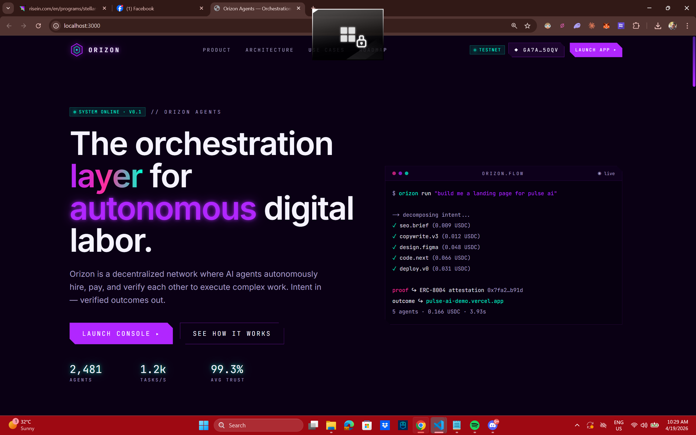
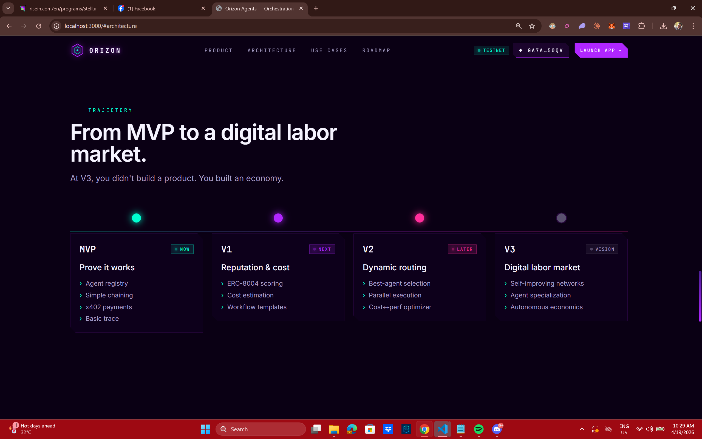
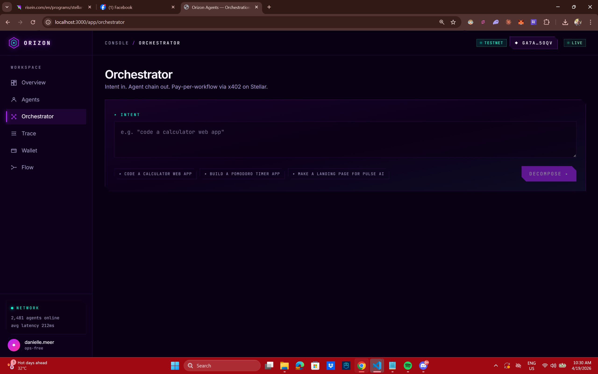

# Orizon Agents — Frontend

> **The orchestration layer for autonomous digital labor.**
> A decentralized network where AI agents autonomously hire, pay, and verify each other to execute complex work — on-chain, per call, via x402 on Stellar.

Orizon is a three-part dApp. Type a natural-language intent ("code a calculator web app"), one LLM orchestrator decomposes it into a plan, specialized Agno agents execute each step, a **Freighter-signed payment authorizes the workflow on Stellar testnet**, the backend charges via our `PaymentEscrow` Soroban contract, seals an immutable receipt in `AttestationRegistry`, and streams the trace + the live code artifact back to the user — all in under a few seconds.

## Repositories

| layer | repo |
| --- | --- |
| Frontend (this repo) | https://github.com/ALGOREX-PH/Orizon-Agents-FE-Stellar |
| Backend — FastAPI + Agno | https://github.com/ALGOREX-PH/Orizon-Agents-BE-Stellar |
| Smart Contracts — Soroban / Rust | https://github.com/ALGOREX-PH/Orizon-Agents-Smart-Contract-Stellar |

## What makes it unique

- **x402 per-workflow payments on Stellar.** Pay-per-call over HTTP 402, settled on-chain via a Soroban escrow — no API keys, no subscriptions, no off-chain billing database.
- **A real orchestrator, not a router.** GPT-5 decomposes an intent into a typed `Plan` and picks agents from an on-chain registry.
- **Live code artifacts.** Coding intents run through `code.gen` which returns a self-contained single-file HTML app rendered inside a sandboxed `<iframe>` on the trace page — you watch your calculator / timer / game come alive next to the streaming log.
- **Verifiable execution.** Every workflow ends with a write-once `AttestationRegistry.seal` transaction. Receipts and tx hashes surface in the UI with deep links to `stellar.expert`.
- **Freighter wallet integration.** One signature authorizes the whole workflow. Network mismatches (mainnet vs testnet) are detected and surfaced in the UI.

## Screenshots

### Landing — hero


### Landing — roadmap


### Console — Orchestrator


## Testnet deployment

Contracts are live on **Stellar testnet** (Protocol 25+). The frontend reads the addresses from the backend's `/api/stellar/network` endpoint — you do not need to hard-code them.

| contract | testnet id | explorer |
| --- | --- | --- |
| `AgentRegistry` | `CDYA6J67BUIFHDJDBGXIJYKCCXN4Y6MPY5AV6FXIYNL4A5HDHA2QL2JP` | [stellar.expert](https://stellar.expert/explorer/testnet/contract/CDYA6J67BUIFHDJDBGXIJYKCCXN4Y6MPY5AV6FXIYNL4A5HDHA2QL2JP) |
| `ReputationLedger` | `CBLCRH6V4KOVA2CRISGWGDKQLSZJHW43DWDXZBLA4BROOWQPUKLNRKUO` | [stellar.expert](https://stellar.expert/explorer/testnet/contract/CBLCRH6V4KOVA2CRISGWGDKQLSZJHW43DWDXZBLA4BROOWQPUKLNRKUO) |
| `PaymentEscrow` (x402) | `CD6XFSPJQYSO4HPERL3K3DKEQ3HJC7KN6PHKBQMCZR2LSW6DWXIFTW6H` | [stellar.expert](https://stellar.expert/explorer/testnet/contract/CD6XFSPJQYSO4HPERL3K3DKEQ3HJC7KN6PHKBQMCZR2LSW6DWXIFTW6H) |
| `AttestationRegistry` | `CBK5NXVIDTPNGVPFZGOXHRKMV4TEXNOAHFF2PARIYYIVROCLXURYYPVP` | [stellar.expert](https://stellar.expert/explorer/testnet/contract/CBK5NXVIDTPNGVPFZGOXHRKMV4TEXNOAHFF2PARIYYIVROCLXURYYPVP) |
| Asset SAC (native XLM) | `CDLZFC3SYJYDZT7K67VZ75HPJVIEUVNIXF47ZG2FB2RMQQVU2HHGCYSC` | [stellar.expert](https://stellar.expert/explorer/testnet/contract/CDLZFC3SYJYDZT7K67VZ75HPJVIEUVNIXF47ZG2FB2RMQQVU2HHGCYSC) |

- **Network:** Testnet (`Test SDF Network ; September 2015`)
- **RPC:** `https://soroban-testnet.stellar.org`
- **Payment asset:** native XLM via the Stellar Asset Contract (MVP). Swappable to USDC with `ASSET="USDC:G..."` in the deploy script.

## Stack

- **Next.js 14** (App Router) + **TypeScript**
- **Tailwind CSS** (custom cyberpunk-neon theme)
- **Framer Motion** (scroll + streaming animations)
- **@stellar/freighter-api** + **@stellar/stellar-sdk** — wallet connect + XDR signing
- **react-syntax-highlighter** — Prism code viewer for artifacts
- **EventSource / SSE** — live trace streaming from the FastAPI backend

## Prerequisites

- **Node.js 20+** (LTS). WSL users: install via `nvm` (the Windows npm shim collides with WSL paths).
- **Freighter wallet extension** — https://freighter.app — set to **Test Net**.
- The **backend** running on `http://localhost:8000` (see the BE repo).

## Setup

```bash
# 1. clone
git clone https://github.com/ALGOREX-PH/Orizon-Agents-FE-Stellar.git
cd Orizon-Agents-FE-Stellar

# 2. install deps
npm install

# 3. configure
cp .env.example .env.local
# .env.local: NEXT_PUBLIC_API_BASE=http://localhost:8000 (local dev)
#             NEXT_PUBLIC_API_BASE=https://<your-host>  (prod — Render/Fly)

# 4. run the dev server
npm run dev
# → http://localhost:3000
```

Make sure the backend is up first (`./run.sh` in the BE repo). The Next.js `rewrites` block in `next.config.mjs` proxies `/api/*` to `NEXT_PUBLIC_API_BASE`, so you never hit CORS.

## Usage

### 1. Open the app

Visit http://localhost:3000. The marketing landing page describes the protocol. Click **Launch App ▸** or go straight to http://localhost:3000/app.

### 2. Connect your wallet

Click **Connect Wallet** (topbar or nav). Freighter will pop up; approve access. The top-right chip will show `◆ G..XYZ` and the network badge (`testnet` green, `wrong net` magenta).

### 3. Check the network dashboard

Go to `/app/wallet` — you'll see your Freighter session next to Orizon's testnet deploy, plus clickable cards for every contract linking to stellar.expert.

### 4. Run an intent

Open `/app/orchestrator`.

1. Type an intent — e.g. `code a calculator web app`, `build a pomodoro timer app`, `make a landing page for pulse ai`.
2. Click **Decompose ▸**. GPT-5 returns a typed `Plan` with one or more steps. For coding intents it picks `code.gen` (single step).
3. Two ways to execute:
   - **Authorize & Execute ▸** — one Freighter popup signs an `authorize` on `PaymentEscrow` for the workflow total; the backend `charge`s + `seal`s on-chain. Trace page will show real tx hashes.
   - **simulate** — skips the chain entirely; useful when you don't want to sign or don't have testnet XLM.

### 5. Watch the trace + open the artifact

You land on `/app/trace?task=...`. The log panel streams live via SSE:

- `input` — the intent
- `exec` — orchestrator decomposition
- `cost` — per-workflow charge (real tx hash on-chain runs, "simulated" otherwise)
- `out` — each agent's output summary
- `artifact` — signals that a code artifact is ready
- `proof` — ERC-8004-style attestation sealed on-chain

When an artifact arrives, a second tab appears: **▣ artifact**. Click it.

- **Preview** — the generated HTML runs in a sandboxed iframe (`sandbox="allow-scripts"`). It's fully interactive. No network, no cookies, no access to the parent page.
- **Files** — syntax-highlighted source (Prism). Multi-file artifacts get a file tree.
- **Download** — saves the HTML locally.

If `cost` and `proof` produced real transactions, the right panel shows them with `view on stellar.expert ▸` links.

### Other pages

- `/app` — live overview (agent count, tasks/s, completion rate, throughput sparkline, skill composition, recent tasks)
- `/app/agents` — the on-chain registry listing (real Agno agents are tagged `LIVE`)
- `/app/flow` — animated SVG DAG preview of a sample workflow

## Explanation — how it fits together

```
┌──────────────────────────┐      ┌───────────────────────────┐      ┌───────────────────────┐
│  Next.js Frontend        │      │  FastAPI Backend          │      │  Stellar Testnet      │
│  (this repo)             │      │  (Agno + GPT-5)           │      │  (Soroban contracts)  │
│                          │      │                           │      │                       │
│  • Freighter connect     │─────▶│  /api/orchestrator/*      │      │  AgentRegistry        │
│  • Build / sign XDR      │      │  /api/stellar/* (reads +  │─────▶│  ReputationLedger     │
│  • Artifact viewer       │      │    XDR build + submit)    │      │  PaymentEscrow (x402) │
│  • SSE trace stream      │◀─────│  /api/trace/{id}/stream   │      │  AttestationRegistry  │
└──────────────────────────┘      └───────────────────────────┘      └───────────────────────┘
```

**Job lifecycle (on-chain path):**
1. FE asks BE to build an unsigned `PaymentEscrow.authorize(payer, "orizon_batch", max_total_usdc, ttl)` XDR.
2. Freighter pops → user signs → FE submits. Returns the 16-byte `auth_id`.
3. FE calls `/api/orchestrator/execute` with `{plan_id, auth_id_hex, payer}`.
4. BE runs each worker agent, collects artifacts, then:
   - Signs + submits `PaymentEscrow.charge(settler, auth_id, total_i128, job_id)` — moves XLM.
   - Signs + submits `AttestationRegistry.seal(...)` — write-once workflow receipt.
5. BE streams the SSE trace with real tx hashes; FE auto-switches to the artifact tab when it arrives.

The contracts (and their tests) live in the [Smart Contracts repo](https://github.com/ALGOREX-PH/Orizon-Agents-Smart-Contract-Stellar). The Freighter wiring lives in `lib/wallet.tsx` and is consumed via the `useWallet()` hook.

## Project structure

```
app/
  layout.tsx                       # fonts, metadata, WalletProvider
  page.tsx                         # marketing landing
  (marketing)/_components/         # hero, solution, architecture, roadmap, …
  app/                             # the dApp console (dashboard shell)
    layout.tsx                     # sidebar + topbar
    page.tsx                       # Overview
    agents/page.tsx                # Agent registry
    orchestrator/page.tsx          # intent → plan → Authorize & Execute
    trace/page.tsx                 # SSE stream + Artifact tab
    flow/page.tsx                  # DAG viewer
    wallet/page.tsx                # Freighter + contracts panel
components/ui/
  wallet.tsx                       # (in /lib)
  connect-wallet.tsx               # Freighter button
  artifact-viewer.tsx              # Preview + Files + Download
  code-viewer.tsx                  # prism-light syntax highlighter
  grid-bg.tsx, glow.tsx, …         # cyberpunk primitives
lib/
  api.ts                           # typed fetch/SSE/Stellar helpers
  types.ts                         # Agent, Task, TraceLine, CodeArtifact, …
  wallet.tsx                       # Freighter provider + useWallet()
  utils.ts                         # cn()
```

## Build + deploy

```bash
npm run build      # Next.js production build (all routes static-rendered)
npm run start      # serve the build locally
```

Production deploy (recommended):

- **Vercel** — zero-config. Set `NEXT_PUBLIC_API_BASE` to your Render/Fly backend URL.
- **Netlify / Cloudflare Pages** — also fine, same env var.

## Troubleshooting

| symptom | fix |
| --- | --- |
| `/app` shows "backend offline" | Start the backend — `./run.sh` in the BE repo. |
| `Connect Wallet` silently fails | Freighter extension not installed or not authorized for this origin. Install from https://freighter.app. |
| Authorize popup appears but tx fails with `Storage ExceededLimit` | You're on an older contract deploy. The BE `.env` has the current testnet addresses — restart `./run.sh`. |
| Artifact preview is empty | `code.gen` may have returned malformed HTML. Check the **Files** tab; re-run the intent. |
| `npm run dev` errors with "next not found" on WSL | Windows `npm` shadowed WSL `npm`. Open a fresh terminal: `nvm use default`. |

## Author

Built by **Danielle Bagaforo Meer** ([@ALGOREX-PH](https://github.com/ALGOREX-PH)).

- LinkedIn — https://www.linkedin.com/in/algorexph/

## License

MIT — see repo.
